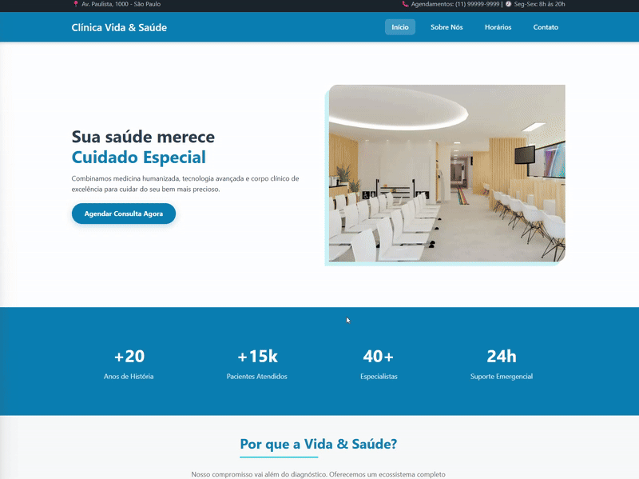

<div align="center">
<h1> 🏥 Página Clínica </h1>




[](https://www.rodrigodev.net/)
[](https://github.com/Rodrigogfernandes)
[](https://www.linkedin.com/in/rodrigogfernandes/)
[](https://www.instagram.com/rodrigogfernandes1/)

</div>

## 📋 Sobre o Projeto

Site institucional simples para uma clínica, construído com HTML e CSS. Contém páginas principais como `index.html`, `about.html`, `contact.html` e `schedules.html`, além de assets para estilos e imagens.

Este repositório serve como uma landing page responsiva para apresentação de serviços, contatos e agendamento de horários.

## ✨ Funcionalidades

- ✅ **Páginas informativas**: Home, Sobre, Contato e Agendamentos
- 📱 **Responsivo**: Layout adaptado para desktop e mobile
- 🎨 **Estilos modernos**: Arquivo de estilos em `assets/css/styles.css`
- 📷 **Imagens e GIFs**: Recursos em `assets/img/` (inclui gifs e ícones)

## 🛠️ Tecnologias Utilizadas

- **HTML5**
- **CSS3**
**

## 🚀 Como Usar

### Pré-requisitos

- Navegador web moderno (Chrome, Firefox, Edge, Safari)
- Servidor local (opcional, recomendado para rotas relativas)

### Executando localmente

Abra o `index.html` no navegador ou sirva o diretório via um servidor local. Exemplos:

## 📁 Estrutura do Projeto

```
pagina-clinica/
│
├── [index.html](http://_vscodecontentref_/3)
├── [about.html](http://_vscodecontentref_/4)
├── [contact.html](http://_vscodecontentref_/5)
├── [schedules.html](http://_vscodecontentref_/6)
├── assets/
│   ├── css/
│   │   └── styles.css
│   └── img/
│       └── gif/
```

## 🎯 Melhorias Futuras

- [ ] Formulário de contato funcional (backend)
- [ ] Integração com sistema de agendamento
- [ ] Acessibilidade aprimorada e SEO
- [ ] Animações e UX mais ricas

## 👨‍💻 Autor

<div align="center">

**Rodrigo Guedes Fernandes**

[](https://www.rodrigodev.net/)
[](https://github.com/Rodrigogfernandes)
[](https://www.linkedin.com/in/rodrigogfernandes/)
[](https://www.instagram.com/rodrigogfernandes1/)


Desenvolvedor Full Stack especializado em tecnologias web modernas.

</div>

---


## 📄 Licença

Este projeto é de código aberto e está disponível para uso livre.
